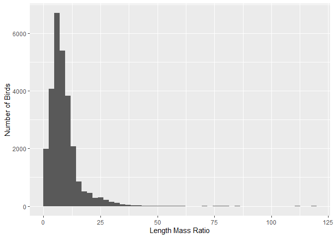
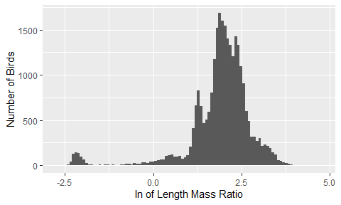
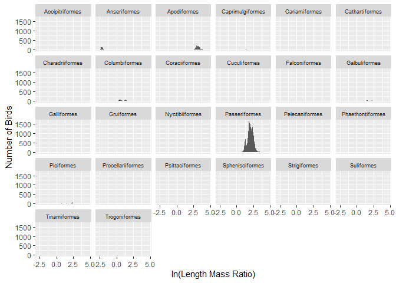
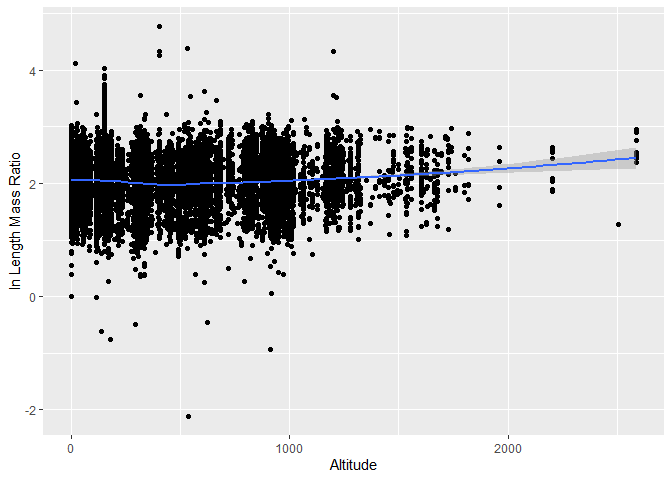
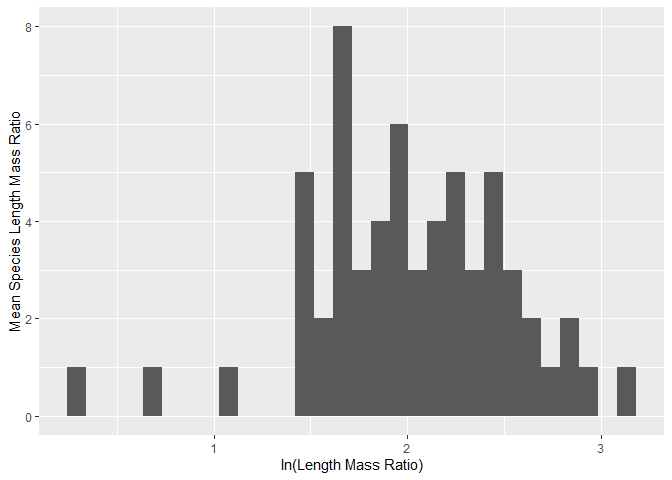
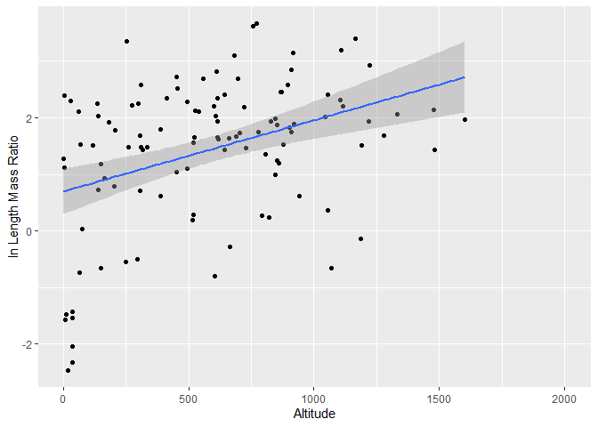
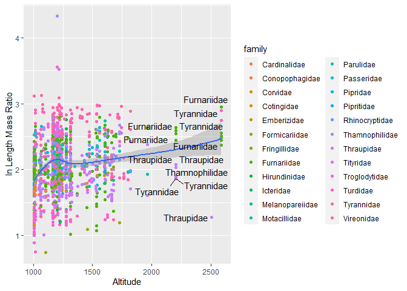
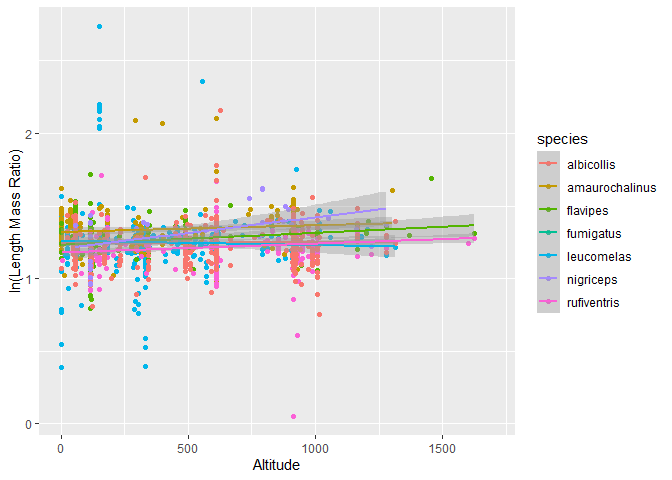
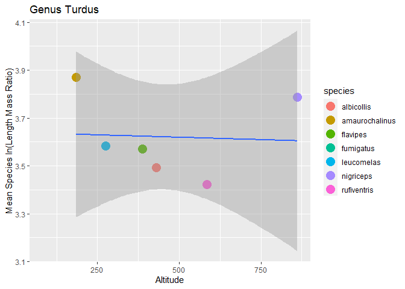
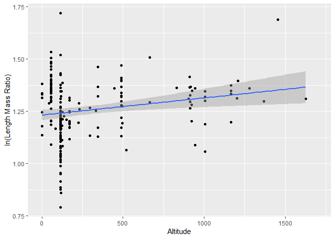

# **Morphological Analysis of Birds in the Atlantic Forest of South America**

Casey Perkins, Bryn Rivenes

## Introduction

-   Allen’s Rule states that body surface area to volume ratio for
    animals varies with the average temperature of a creature’s habitat
    (Allen A, 1877)​. This rule is based on the idea that an animal in a
    colder habitat should have a lower surface area so that they do not
    lose as much heat. Conversely, animals in warmer climates should
    have larger surface areas to allow more heat to escape.

-   There are several studies that give evidence for the validity of
    Allen’s Rule. This study showed the major impacts that the
    environment had on body mass and wing length of birds. They found
    larger birds were found at higher altitudes (Sun Y, *et al.,* 2022).
    Other studies show that body weight increases with altitude
    (Landmann A and Winding N, 1995)(Blackburn T and Ruggiero A, 2001).

-   However, there are are also studies that give evidence against
    Allen’s Rule. In one study, it was found that frogs actually had
    larger surface areas in colder temperatures. The authors suggested
    there may be a more substantial genetic influence rather than a
    environment influence (Alho J, et al. 2010).

-   We set out to test Allen’s Rule using an existing data set of bird
    morphological traits called the Atlantic Birds data set.

    

## Methods

-   The Atlantic Birds data set was complied over decades by many
    scientists through museum collections, online data bases, published
    sources, and unpublished reports for data analysis (Hasui E, et
    al. 2017)​.

-   The Atlantic Forest is located on the East coast of Brazil and it
    stretches into Argentina and Paraguay​. This area has significant
    changes in altitude which we used as our temperature variable.

-   We used the length to mass ratio as a proxy for body
    surface-area-to-volume ratio.

-   We used RStudio to compute our data (RStudio Team, 2019). In
    addition, we used R packages tidyverse (Wickham *et al*., 2019),
    ggplot2 (Wickham H, 2016) and ggrepel (Slowikowski *et al.*, 2021).

    

## Results

We begin with plotting our entire data set. The data displays a severe
right skew.

<!-- -->

###### Fig. 1: Histogram of the length mass ratio of birds in the data set

To correct for the skew, we transform the data using the natural log of
each data point and graph the data again. We observe a hump on the left
side of the data.

<!-- -->

###### Fig. 2: Histogram of the natural log of length mass ratio of birds in the data set

To find the source of the hump, we break out each order into it’s own
graph. From this graph, we can see that the hump is cause by order
Anseriformes (ducks). This makes sense as ducks should have a much
smaller length to mass ratio than the majority of birds in the data set.
The order that makes up the most of the data set appears to be order
Passeriformes (songbirds). In addition, this order appears to have a
normal distribution and relatively similar birds. This makes order
Passeriformes a good test subject for Allen’s Rule.

<!-- -->

###### Fig. 3: Histogram of the natural log of length to mass ratio of individual bird orders in the data set

Here we are looking for any trends in the length mass ratio vs altitude
of Passeriformes, and we find there is a slight upward trend in the
regression line that becomes more pronounced as altitude increases.

<!-- -->

###### Fig. 4: Scatter plot of order the ln length mass ratio of Passeriformes vs altitude

Here we find a relatively normal distribution of mean ln length mass
ratio for each species in order Passeriformes.

<!-- -->

###### Fig. 5: Histogram of mean species ln length mass ratio for order Passeriformes

When we run the mean of each species against altitude and add a
regression line, we find that there is a positive correlation.

<!-- -->

###### Fig. 6: Scatter plot of mean species ln length mass ratio for order Passeriformes with regression line. Error is represented by transparent area

To get a better look at the trend, we look at birds found only above
1000 meters and color code them by family. They receive a label only if
they are found over 2000 meters. We notice six families that appear over
2000 meters.

<!-- -->

###### Fig. 7: Scatter plot of order Passeriformes ln length mass ratio vs altitude over 1000 meters colored by family

Perhaps this trend is a result of including too many genra together. We
separate out genus *Turdus* to see if this has an effect on the
regression line. While we find that there is a slight downward trend in
some of the species means for genus *Turdus*, we do not see this trend
when we look at individuals in the genus.

<!-- -->

###### Fig. 8: Scatter plot of ln length to mass ratio vs altitude by species for genus *Turdus*

When we take the mean ln length to mass ratio of each species in genus
*Turdus*, we do find a slight downward trend with one outlying species,
nigreceps.

<!-- -->

###### Fig. 9: Scatter plot of mean ln length to mass ratio vs altitude for all species in genus *Turdus*

While there does not appear to be any significant trends in this
individual genus, we do see significant differences in the mean length
mass ratio for each species of order Passeriformes. However, we see the
opposite trend that Allen’s Rule would predict.

<!-- -->

###### Fig. 10: Histogram of the mean ln length to mass ratio for order Passeriformes divided into those found over and under 1000 meters

The mean lmr of birds found above 1000 m = 7.9 while the mean lmr of
birds found below 1000 m = 5.2. A Welch’s Two Sample t-test found these
results to be significant t(76) = 3.6, p =0.0005.

## Discussion

-   We predicted length mass ratio would decrease with elevation
    however, our analysis and t-test show an increase in length mass
    ratio with increased elevation​. Even when separating out an
    individual species, there was no trend towards fatter, fluffier
    birds in colder climates. This is the exact opposite of what we
    would expect to see according to Allen’s Rule.

-   Other studies have found similar results that contradict Allen’s
    Rule and suggest that the body surface area to volume ratio has a
    genetic basis rather than an environmental one (Alho J, et
    al. 2010). For the birds in the Atlantic Forest, this would mean
    that their length to mass ratio is more depended on their individual
    genetic makeup rather than the climate they live in.

-   While we did not find any evidence of Allen’s Rule playing out among
    order Passeriforms as a whole or genus Turdus as a whole, there may
    be other factors clouding our data. In a future study, we would like
    to look at exclusivley non-migratory birds. This would be a control
    for birds who live in higher altitudes in warmer months and migrate
    in cooler months. These birds would not need to have a low length to
    mass ratio because of their migration patterns, but they would cause
    the mean length to mass ratio of a genus to show an upward trend.

## References

-   Blackburn T, Ruggiero A. Latitude, elevation and body mass variation
    in Andean passerine birds. Global Ecology and Biography 2001 (cited
    2022 Feb 18); 10: 245-259.

-   Hasui, É., Metzger, J.P., Pimentel, R.G., Silveira, L.F., Bovo,
    A.A.d.A., Martensen, A.C., Uezu, A., Regolin, A.L., Bispo de
    Oliveira, A.Â., Gatto, C.A.F.R., Duca, C., Andretti, C.B.,
    Banks-Leite, C., Luz, D., Mariz, D., Alexandrino, E.R., de Barros,
    F.M., Martello, F., Pereira, I.M.d.S., da Silva, J.N., Ferraz,
    K.M.P.M.d.B., Naka, L.N., dos Anjos, L., Efe, M.A., Pizo, M.A.,
    Pichorim, M., Gonçalves, M.S.S., Cordeiro, P.H.C., Dias, R.A.,
    Muylaert, R.d.L., Rodrigues, R.C., da Costa, T.V.V., Cavarzere, V.,
    Tonetti, V.R., Silva, W.R., Jenkins, C.N., Galetti, M. and Ribeiro,
    M.C. (2018), ATLANTIC BIRDS: a data set of bird species from the
    Brazilian Atlantic Forest. Ecology, 99: 497-497.
    <https://doi.org/10.1002/ecy.2119>

-   Landmann A, Winding N. Guild Organization and Morphology of
    High-Altitude Granivorous and Insectivorous Birds: Convergent
    Evolution in an Extreme Environment. Oikos. 2995 (cited 2022 Feb
    18);73(2):237-250.

-   Lho, J.S., Herczeg, G., Laugen, A.T., Rasanen, K., Laurila, A. and
    Merila, J. (2011), Allen’s rule revisited: quantitative genetics of
    extremity length in the common frog along a latitudinal gradient.
    Journal of Evolutionary Biology, 24: 59-70.
    <https://doi.org/10.1111/j.1420-9101.2010.02141.x>​

-   Sun Y, Li M, Song G, Lei F, Li D, Wu Y. The Role of Climate Factors
    in Geographic Variation in Body Mass and Wing Length in a Passerine
    Bird. Avian Res. 2017 (cited 2022 Feb 19); 8, 1.

-   RStudio Team (2019), RStudio: Integrated Development for R. RStudio,
    Inc., Boston, MA, URL <http://www>. rstudio.com/.

-   Wickham *et al*., (2019). Welcome to the tidyverse. Jounal of Open
    Source Software, 4(43), 1686, <http://doi.org/10.21105/joss.01686>

-   Wickham H (2016). ggplot2: Elegant Graphics for Data Analysis.
    Springer-Verlag New York.

-   Slowikowski *et al.*, (2021). ggrepel.
    <https://githubcom/slowkow/ggrepel>

## Acknowledgments

-   We would like to thank the original authors of the Atlantic Birds
    Data Set and all of those who helped compile it through museum
    collections, online data bases, published sources, and unpublished
    reports, as well as the people out out in the field who originally
    collected this data.

-   We also would like to thank Dr. Chris Merkord for his guidance with
    coding and data analysis.
