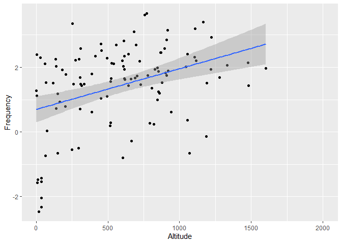
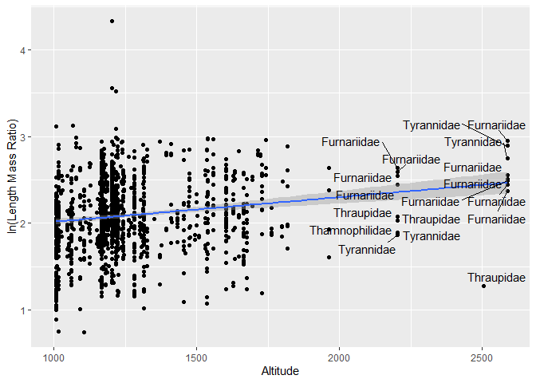

**Notes for code:**

-   **show tidied code, spaces, comments, make it readable, be
    CONSISTANT**

-   **filter, mutate, summarize, join (combine data), variables in code
    and show created variables**

-   **use: bar chart, histogram, multiple variables (scatter plot).
    Label well.**

-   **Do a mean and a confidence interval**

-   **Include a readme with abstract, author name, and table of
    content**

# **Morphological Analysis of Birds in the Atlantic Forest of South America**

Casey Perkins, Bryn Rivenes

## Introduction

-   Allen’s Rule states that body surface area to volume ratio for
    animals varies with the average temperature of a creature’s habitat
    (Allen A, 1877)​. This rule is based on the idea that an animal in a
    colder habitat should have a lower surface area so that they do not
    lose as much heat. Conversely, animals in warmer climates should
    have larger surface areas to allow more heat to escape.

-   There are several studies that give evidence for the validity of
    Allen’s Rule. This study showed the major impacts that the
    environment had on body mass and wing length of birds. They found
    larger birds were found at higher altitudes (Sun Y, *et al.,* 2022).

-   However, there are are also studies that give evidence against
    Allen’s Rule. In one study, it was found that frogs actually had
    larger surface areas in colder temperatures. The authors suggested
    there may be a more substantial genetic influence rather than a
    environment influence (Alho J, et al. 2010).

-   We set out to test Allen’s Rule using an existing data set of bird
    morphological traits called the Atlantic Birds data set.

    

## Methods

-   The Atlantic Birds data set was complied over decades by many
    scientists through museum collections, online data bases, published
    sources, and unpublished reports for data analysis (Hasui E, et
    al. 2017)​.

-   The Atlantic Forest is located on the East coast of Brazil and it
    stretches into Argentina and Paraguay​. This area has significant
    changes in altitude which we used as our temperature variable.

-   We used the length to mass ratio as a proxy for body
    surface-area-to-volume ratio.

-   We used RStudio to compute our data (RStudio Team, 2019). In
    addition, we used R packages tidyverse (Wickham *et al*., 2019),
    ggplot2 (Wickham H, 2016) and ggrepel (Slowikowski *et al.*, 2021).

    

## Results

We begin with plotting our entire data set. The data displays a severe
right skew.

<!-- -->

To correct for the skew, we transform the data using the natural log of
each data point and graph the data again. We observe a hump on the left
side of the data.

<!-- -->

To find the source of the hump, we break out each order into it’s own
graph. From this graph, we can see that the hump is cause by order
Anseriformes (ducks). This makes sense as ducks should have a much
smaller length to mass ratio than the majority of birds in the data set.
The order that makes up the most of the data set appears to be order
Passeriformes (songbirds). In addition, this order appears to have a
normal distribution and relatively similar birds. This makes order
Passeriformes a good test subject for Allen’s Rule.

<!-- -->

Here we are looking for any trends in the length mass ratio vs altitude
of Passeriformes, and we find there is a slight upward trend in the
regression line that becomes more pronounced as altitude increases.

<!-- -->

Here we find a relatively normal distribution of mean ln length mass
ratio for each species in order Passeriformes. When we run the mean of
each species against altitude and add a regression line, we find that
there is a positive correlation.

<!-- --><!-- -->

To get a better look at the trend, we look at birds found only above
1000 meters and color code them by family. They receive a label only if
they are found over 2000 meters. We notice six families that appear over
2000 meters.

<!-- -->

Perhaps this trend is a result of including too many genra together. We
separate out genus *Turdus* to see if this has an effect on the
regression line. While we find that there is a slight downward trend in
some of the species means for genus *Turdus*, we do not see this trend
when we look at individuals in the genus.

<!-- --><!-- -->

While there does not appear to be any significant trends in this
individual genus, we do see significant differences in the mean length
mass ratio for each species of order Passeriformes. However, we see the
opposite trend that Allen’s Rule would predict.

    ## # A tibble: 679 x 6
    ## # Groups:   order, family, genus [380]
    ##    order           family       genus         species       ln_lmr altitude
    ##    <chr>           <chr>        <chr>         <chr>          <dbl>    <dbl>
    ##  1 Accipitriformes Accipitridae Accipiter     bicolor       0.360     1056 
    ##  2 Accipitriformes Accipitridae Accipiter     striatus      1.13       914 
    ##  3 Accipitriformes Accipitridae Amadonastur   lacernulatus -0.134      141.
    ##  4 Accipitriformes Accipitridae Buteo         brachyurus   -0.124       92 
    ##  5 Accipitriformes Accipitridae Buteo         nitidus      -0.0893      26 
    ##  6 Accipitriformes Accipitridae Chondrohierax uncinatus     0.623      943 
    ##  7 Accipitriformes Accipitridae Geranoaetus   albicaudatus -0.551      846 
    ##  8 Accipitriformes Accipitridae Geranospiza   caerulescens  0.197      514 
    ##  9 Accipitriformes Accipitridae Harpagus      diodon        0.608      388 
    ## 10 Accipitriformes Accipitridae Heterospizias meridionalis -0.402      592.
    ## # ... with 669 more rows

<!-- -->

The mean lmr of birds found above 1000 m = 7.9 while the mean lmr of
birds found below 1000 m = 5.2. A Welch’s Two Sample t-test found these
results to be significant t(76) = 3.6, p =0.0005.

    ## 
    ##  Welch Two Sample t-test
    ## 
    ## data:  ln_lmr by hilo
    ## t = 3.6392, df = 75.921, p-value = 0.0004966
    ## alternative hypothesis: true difference in means between group Above 1000 m and group Below 1000 m is not equal to 0
    ## 95 percent confidence interval:
    ##  0.1901300 0.6498424
    ## sample estimates:
    ## mean in group Above 1000 m mean in group Below 1000 m 
    ##                   2.067247                   1.647261

-   **Text describing what we did and what it means then back up with
    figure/graph**

-   **add figure legends to each graph (Fig. 1)**

## Discussion

-   We predicted length mass ratio would decrease with elevation
    however, our analysis and t-test show an increase in length mass
    ratio with increased elevation​

-   This is the exact **opposite** of what we would **e**xpect to see
    according to **Allen’s Rule** ​

-   Other studies have found similar results that contradict **Allen’s
    Rule** and suggest that the body surface area to volume ratio has a
    genetic basis rather than an environmental one (Alho J, et al. 2010)

-   **Restate findings briefly**

-   **talk about what it MEANS**

-   **talk about what we could do with these findings in the
    future/future experiments**

## References

-   Blackburn T, Ruggiero A. Latitude, elevation and body mass variation
    in Andean passerine birds. Global Ecology and Biography 2001 (cited
    2022 Feb 18); 10: 245-259.

-   **Hasui, É., Metz**ger, J.P., Pimentel, R.G., Silveira, L.F., Bovo,
    A.A.d.A., Martensen, A.C., Uezu, A., Regolin, A.L., Bispo de
    Oliveira, A.Â., Gatto, C.A.F.R., Duca, C., Andretti, C.B.,
    Banks-Leite, C., Luz, D., Mariz, D., Alexandrino, E.R., de Barros,
    F.M., Martello, F., Pereira, I.M.d.S., da Silva, J.N., Ferraz,
    K.M.P.M.d.B., Naka, L.N., dos Anjos, L., Efe, M.A., Pizo, M.A.,
    Pichorim, M., Gonçalves, M.S.S., Cordeiro, P.H.C., Dias, R.A.,
    Muylaert, R.d.L., Rodrigues, R.C., da Costa, T.V.V., Cavarzere, V.,
    Tonetti, V.R., Silva, W.R., Jenkins, C.N., Galetti, M. and Ribeiro,
    M.C. (2018), ATLANTIC BIRDS: a data set of bird species from the
    Brazilian Atlantic Forest. Ecology, 99: 497-497.
    <https://doi.org/10.1002/ecy.2119>

-   Lamichhaney S, Han F, Berglund J, Wang C, Almén MS, Webster MT,
    Grant BR, Grant PR, Andersson L. A beak size locus in Darwin’s
    finches facilitated character displacement during a drought.
    Science. 2016 (cited 2022 Feb 18);352(6284):470-4

-   Landmann A, Winding N. Guild Organization and Morphology of
    High-Altitude Granivorous and Insectivorous Birds: Convergent
    Evolution in an Extreme Environment. Oikos. 2995 (cited 2022 Feb
    18);73(2):237-250.

-   **Lho,** J.S., Herczeg, G., Laugen, A.T., Rasanen, K., Laurila, A.
    and Merila, J. (2011), Allen’s rule revisited: quantitative genetics
    of extremity length in the common frog along a latitudinal gradient.
    Journal of Evolutionary Biology, 24: 59-70.
    <https://doi.org/10.1111/j.1420-9101.2010.02141.x>​

-   **Sun** Y, Li M, Song G, Lei F, Li D, Wu Y. The Role of Climate
    Factors in Geographic Variation in Body Mass and Wing Length in a
    Passerine Bird. Avian Res. 2017 (cited 2022 Feb 19); 8, 1.

-   **RStudi**o Team (2019), RStudio: Integrated Development for R.
    RStudio, Inc., Boston, MA, URL <http://www>. rstudio.com/.

-   **Wickham** *et al*., (2019). Welcome to the tidyverse. Jounal of
    Open Source Software, 4(43), 1686,
    <http://doi.org/10.21105/joss.01686>

<!-- -->

-   **Wickha**m H (2016). ggplot2: Elegant Graphics for Data Analysis.
    Springer-Verlag New York.

-   **Slowiko**wski *et al.*, (2021). ggrepel.
    <https://githubcom/slowkow/ggrepel>

-   **add citations for R, and pkgs used.**

-   **cite every source in the text**

## Acknowledgments

-   We would like to thank the original authors of the Atlantic Birds
    Data Set and all of those who helped compile it through museum
    collections, online data bases, published sources, and unpublished
    reports, as well as the people out out in the field who originally
    collected this data.

-   We also would like to thank Dr. Chris Merkord for his guidance with
    coding and data analisis.
